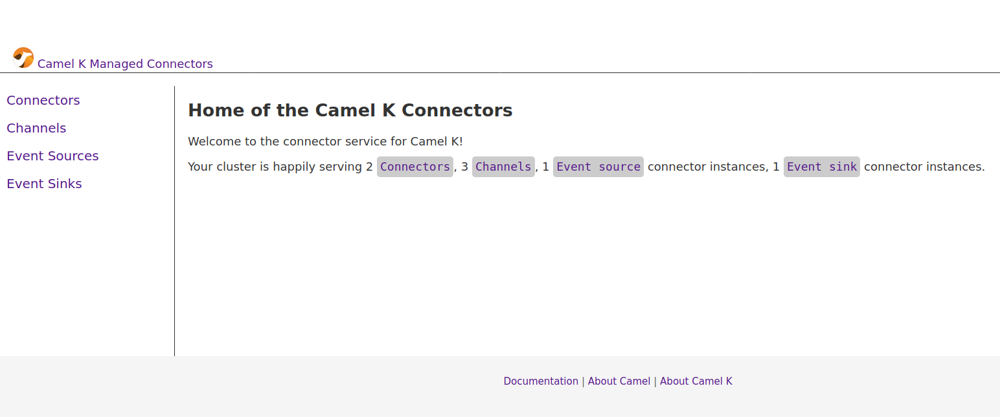

## Prerequisites

You will need to connect to a Kubernetes cluster (also Minikube is fine) where Camel K operator version 1.2 is installed. For the time being this project is supporting also Strimzi Kafka to use the topics as `Channel`s.

## Install Jabberwocky to a Kubernetes cluster

This installation procedure will provide the complete installation procedure to have a `ui` and `server` running for the Jabberwocky code name project. You must be logged with admin privileges in order to complete the installation.

```
./install.sh
```

The output will provide information on which URL the application will be available (if you're on minikube just run `minikube service jabberwocky-ui`). You will be brought to an application that should look like the following snapshot:


